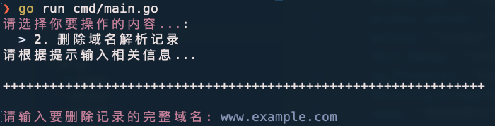
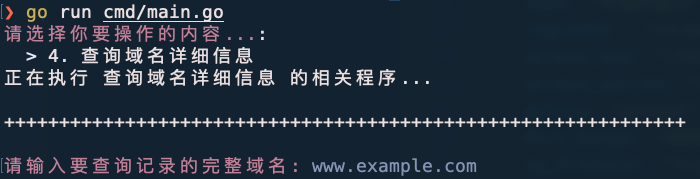

<h1 align="center">
  <a href="https://github.com/WillemCode">
    <br>
  </a>
</h1>
  <p align="center">简体中文 | <a href="./docs/README.tc.md">繁体中文</a> | <a href="./docs/README.en.md">English</a> | <a href="./docs/README.ja.md">日本語</a><br></p>

# 阿里云域名管理工具
🔍 **一个快速管理多账号阿里云域名解析的小工具**
自动识别域名所属账号，支持添加、删除、修改、查询解析记录，解决多账号域名管理的混乱问题。

---
## ✨ 功能特性
- **多账号支持**：同时配置多个阿里云 AK/SK，自动匹配域名所属账号。
- **一键操作**：无需手动切换账号，直接管理域名解析。
- **核心功能**：
  - ✅ 添加域名解析记录（A/CNAME/MX/TXT 等）
  - ✅ 删除域名解析记录
  - ✅ 修改域名解析记录
  - ✅ 查询域名详细信息
  - 🔍 模糊搜索域名信息 (www/example.com/www.example.com)
- **轻量高效**：Go 语言开发，命令行交互，快速响应。
---
## 🚀 快速开始
### 安装方式
#### 1. 直接运行（需 Go 环境）
```bash
git clone https://github.com/WillemCode/AliCloud_Domain.git
cd AliCloud_Domain
go run cmd/main.go
```
#### 2. 下载二进制文件（推荐）

---
### 配置步骤
1. **添加阿里云账号**
   在程序首次运行时，在项目目录中创建 `config.yaml` 按以下格式输入阿里云 AccessKey（AK）和 SecretKey（SK），支持添加多个账号。
```yaml
aliyun_accounts:
  - name: "域名阿里云-01"
    regionId : "cn-hangzhou"
    access_key: "·····················"
    access_secret: "···························"
  - name: "域名阿里云-02"
    regionId : "cn-beijing"
    access_key: "·····················"
    access_secret: "···························"
  - name: "域名阿里云-03"
  ······
```
2. **选择操作**
   运行后会出现交互式菜单：
   ```text
   请选择你要操作的内容... [type to search]: 
   > 1. 添加域名解析记录
     2. 删除域名解析记录
     3. 修改域名解析记录
     4. 查询域名详细信息
     5. 模糊搜索域名信息
   ```
---
## 📸 使用示例
### 添加解析记录

### 删除解析记录

### 修改解析记录

### 查询解析记录

### 模糊搜索域名

---
## ⚙️ 技术栈
- **语言**: Go
- **阿里云 SDK**: [Alibaba Cloud Go SDK](https://github.com/aliyun/alibaba-cloud-sdk-go)
- **命令行交互**: [Cobra](https://github.com/spf13/cobra) [Pterm](https://github.com/pterm/pterm)
---

## 贡献与支持
- **Issues**：如在使用过程中遇到问题或有新需求，欢迎在仓库的 Issue 中提出。
- **Pull Requests**：欢迎参与贡献新的功能、优化或文档修复。

## 📜 开源协议

本项目采用 [GNU General Public License (GPL)](./LICENSE) 进行开源发布。  
这意味着：

- 你可以自由复制、修改和分发本项目的源代码，但修改后的项目也必须继续以 GPL 或兼容的许可证进行发布；
- 分发或发布时，需包含本项目的原始版权声明与 GPL 协议文本，并提供完整的源代码获取方式。

请参阅 [LICENSE](./LICENSE) 文件获取详细条款。若你对 GPL 的使用及合规性有任何疑问，请查阅 [GNU 官网](https://www.gnu.org/licenses/) 或咨询相关专业人士。

---
## 🙋 常见问题
**Q: 如何保证 AK/SK 的安全性？**
A: 所有凭据仅存储在本地配置文件中（如 `config.yaml`），**不会上传到服务器**。
**Q: 支持国际版阿里云吗？**
A: 是，修改 SDK 的 `Endpoint` 即可。
---

## Star History

[](https://www.star-history.com/#WillemCode/AliCloud_Domain&Date)
