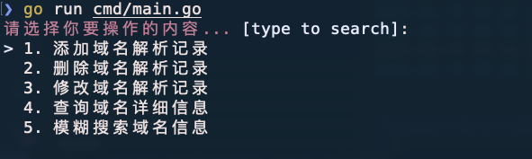
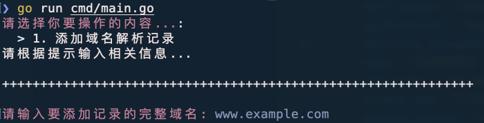
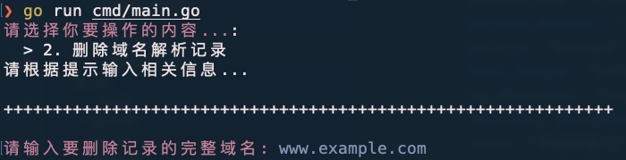
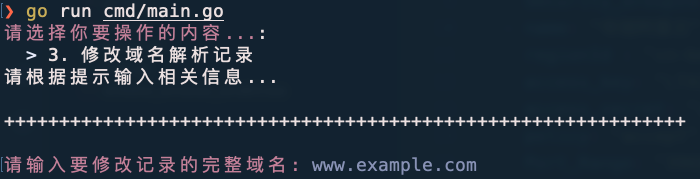
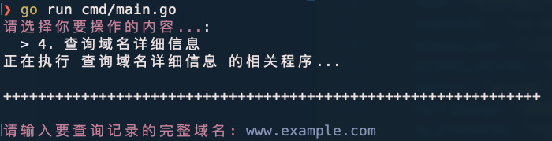
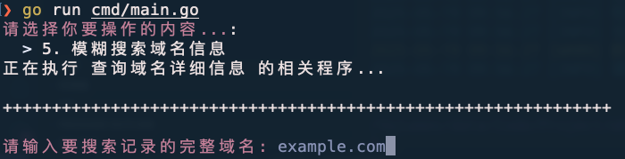

# 阿里雲ドメイン管理ツール

🔍 **複数アカウントの阿里雲DNSレコードを管理する軽量ツール**

ドメインの所有アカウントを自動識別し、追加/削除/変更/検索操作をサポート



---
## ✨ 特徴
- **複数アカウント対応**: 複数のAK/SKを設定可能
- **ワンクリック操作**: アカウント切替不要でDNS管理
- **主要機能**:
  - ✅ DNSレコード追加 (A/CNAME/MX/TXT等)
  - ✅ DNSレコード削除
  - ✅ DNSレコード変更
  - ✅ ドメイン詳細検索
  - 🔍 あいまい検索 (www/example.com/www.example.com)
- **軽量高效**: Go言語製、CLIインターフェース
---
## 🚀 クイックスタート
### インストール
#### 1. ソースから実行 (Go必要)
```bash
git clone https://github.com/WillemCode/AliCloud_Domain.git
cd AliCloud_Domain
go run cmd/main.go
```
#### 2. バイナリダウンロード (推奨)
---
### 設定
1. **阿里雲アカウント追加**
   `config.yaml` を作成:
```yaml
aliyun_accounts:
  - name: "ドメインアカウント-01"
    regionId : "cn-hangzhou"
    access_key: "·····················"
    access_secret: "···························"
  - name: "ドメインアカウント-02"
    regionId : "cn-beijing"
    access_key: "·····················"
    access_secret: "···························"
  - name: "ドメインアカウント-03"
  ······
```
2. **操作メニュー**
   起動後:
   ```text
   操作を選択... [type to search]: 
   > 1. DNSレコード追加
     2. DNSレコード削除
     3. DNSレコード変更
     4. ドメイン詳細検索
     5. あいまい検索
   ```
---
## 📸 使用例
### レコード追加

### レコード削除

### レコード変更

### レコード検索

### あいまい検索

---
## ⚙️ 技術構成
- **言語**: Go
- **阿里雲SDK**: [Alibaba Cloud Go SDK](https://github.com/aliyun/alibaba-cloud-sdk-go)
- **CLI**: [Cobra](https://github.com/spf13/cobra) [Pterm](https://github.com/pterm/pterm)
---
## 貢献
- **Issues**: 問題報告/機能要望はGitHub Issuesへ
- **PR**: 機能追加/最適化/文書修正歓迎
---
## 📜 ライセンス

[GNU General Public License (GPL)](./LICENSE) で公開:
- 改変・再配布可能ですが、派生作品もGPLで公開必須
- 著作権表示とソースコード提供が条件

---
## 🙋 よくある質問

**Q: AK/SKの安全性は?**

A: ローカル`config.yaml`にのみ保存、アップロードなし

**Q: 国際版阿里雲対応?**

A: SDKの`Endpoint`変更で可能

---
## Star History
[](https://www.star-history.com/#WillemCode/AliCloud_Domain&Date)
